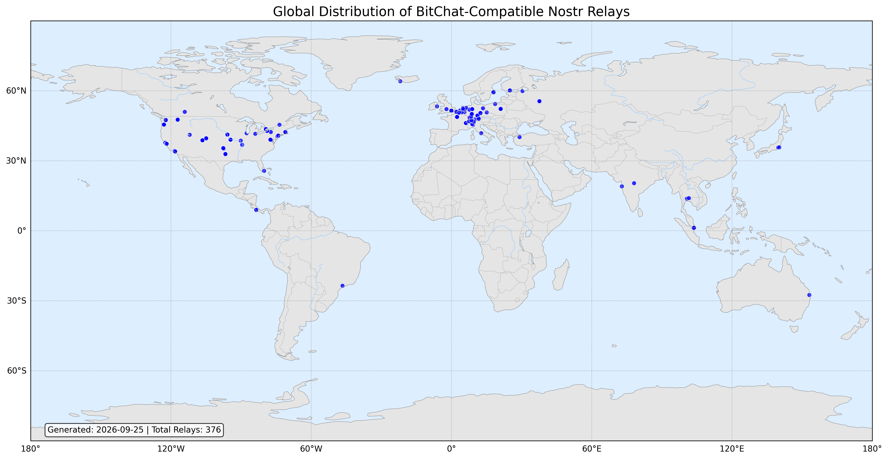
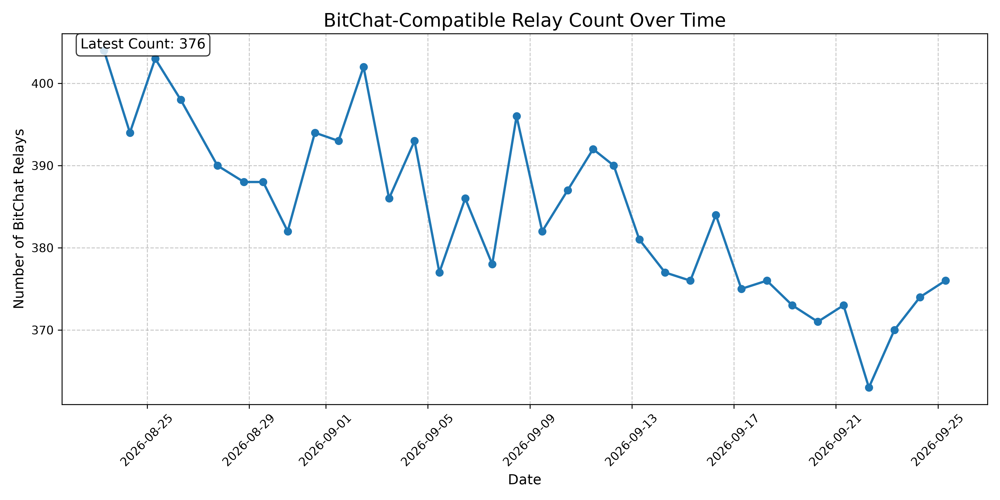
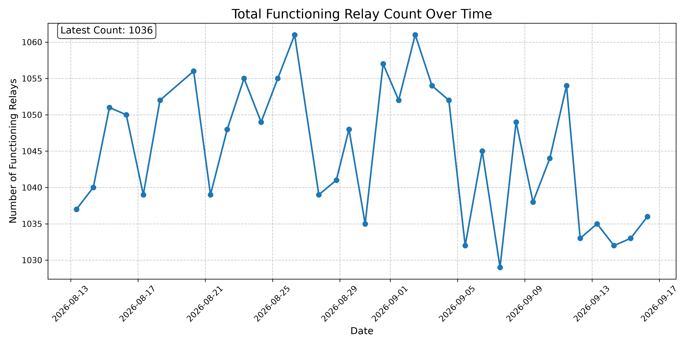

<div align="center">

# 🌍 GeoRelays

**Discover Nostr relays, check BitChat compatibility, and map where they live.**

From one seed relay to a geolocated, continuously updated dataset.

</div>



## What it does

GeoRelays follows the Nostr network outward from a seed relay, verifies which
relays respond, optionally tests them for BitChat support (kind `20000`), and
estimates their locations from IPv4 addresses.

The result is a small, scriptable pipeline:

| Stage | Tool | Result |
| --- | --- | --- |
| Discover | `nostr_relay_discovery.py` | Functioning relays in `relay_discovery_results.json` |
| Filter | `filter_bitchat_relays.sh` | Relays that can read and write kind `20000` events |
| Locate | `relays_geo_lookup.py` | Coordinates in `nostr_relays.csv` |

## Quick start

Install the Python dependencies:

```bash
python3 -m pip install -r requirements.txt
```

Discover relays from a seed:

```bash
python3 nostr_relay_discovery.py wss://relay.damus.io
```

Geolocate every functioning relay:

```bash
jq -r '.functioning_relays[]' relay_discovery_results.json \
  | python3 relays_geo_lookup.py nostr_relays.csv
```

To keep only BitChat-compatible relays, install
[`nak`](https://github.com/fiatjaf/nak) and insert the filter:

```bash
jq -r '.functioning_relays[]' relay_discovery_results.json \
  | ./filter_bitchat_relays.sh \
  | python3 relays_geo_lookup.py nostr_relays.csv
```

The filter performs both a read and a test write, responding to NIP-42
authentication challenges when required. It generates an ephemeral signing key
by default. To test membership-restricted relays, provide an authorized key via
`NOSTR_SECRET_KEY`.

## How discovery works

Discovery performs a breadth-first search through follow lists (kind `3`) and
relay lists (kind `10002`). Each candidate is tested over WebSocket with a Nostr
`REQ`; progress is saved periodically so longer runs remain useful.

NIP-42 authentication is supported with an ephemeral key by default. For
membership-restricted relays, provide an authorized 64-character hex key:

```bash
NOSTR_PRIVATE_KEY=<hex-secret> python3 nostr_relay_discovery.py <seed-relay>
```

Use `--max-depth`, `--batch-size`, and `--timeout` to tune the crawl. Run either
Python script with `--help` for the full command reference.

## Live snapshots

The dataset and visuals are refreshed daily by GitHub Actions.

| BitChat-compatible relays | All functioning relays |
| --- | --- |
|  |  |

For a closer look, open the
[interactive map](assets/relay_locations_interactive.html) or view the
[relay density heatmap](assets/relay_locations_heatmap.png).

## A note on location accuracy

Locations are estimates based on the DB-IP city database. GeoRelays currently
uses IPv4 only, selects the first resolved address with known coordinates, and
may identify a hosting provider or network point of presence rather than the
physical server. IPv6-only relays are skipped.

## Automation

The workflows in [`.github/workflows`](.github/workflows) run discovery,
filtering, geolocation, map generation, and history tracking. The generated
datasets and visuals are committed back to the repository automatically.

## Data attribution

Location data in `nostr_relays.csv` and `relay_discovery_results.json` is derived
from the [DB-IP city database](https://www.db-ip.com).
