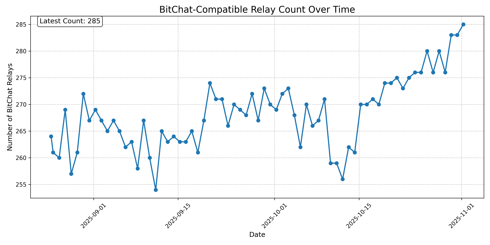
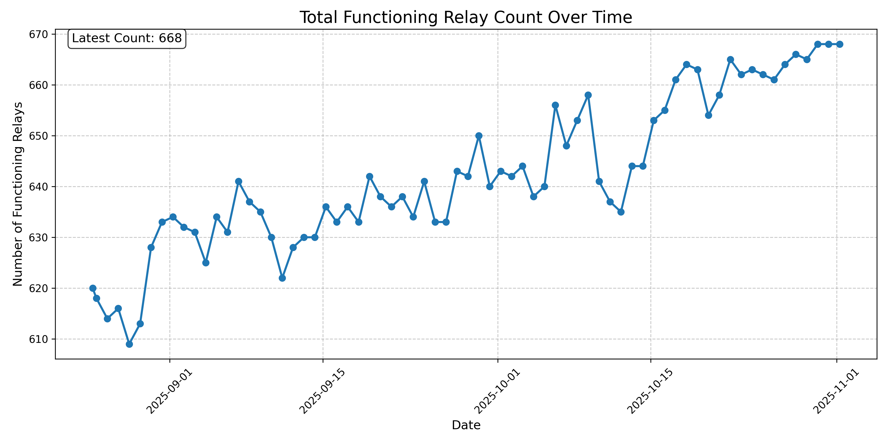

# GeoRelays

A small toolkit to discover Nostr relays and estimate their locations. It can also optionally filter for BitChat-capable relays (kind 20000) before geolocating.

---

## How the georelays dataset is produced

The repository contains three scripts that form a simple pipeline:

1) Discover functioning relays (Python)
- Script: `nostr_relay_discovery.py`
- What it does:
  - Starts from a seed relay URL and connects to it via WebSocket (ws/wss).
  - Breadth‑first searches follow lists (kind 3) and relay lists (kind 10002), extracting relay URLs from event tags (r/p tags).
  - Tests each candidate relay for basic Nostr protocol responsiveness by issuing a REQ and evaluating responses (EVENT/EOSE/NOTICE).
  - Processes relays in concurrent batches and periodically saves progress to `relay_discovery_results.json`.
- Output: `relay_discovery_results.json` with:
  - `functioning_relays` (array of ws/wss relay URLs)
  - discovery settings, progress, and statistics

2) Filter for BitChat relays (kind 20000)
- Script: `filter_bitchat_relays.sh`
- What it does:
  - Reads relay URLs from stdin and, in parallel, checks whether each relay:
    - can return kind 20000 events (read), and
    - accepts posting a kind 20000 event (write).
  - Uses the `nak` CLI to query (`nak req -k 20000`) and post (`nak event -k 20000 ...`).
- Output: writes to stdout the subset of input relay URLs that pass both checks. You can redirect this to a file, e.g., `bitchat_relays.txt`.

3) Geolocate relays (Python)
- Script: `relays_geo_lookup.py <output.csv>`
- What it does:
  - Downloads the DB‑IP city IPv4 ranges (`dbip-city-ipv4-num.csv.gz`), loads it into memory, and uses a binary search to map IPv4s to latitude/longitude.
  - Reads URLs from stdin or file, resolves them asynchronously to A records, and looks up the first IPv4 with available coordinates.
- Input: ws/wss URLs or hostnames (e.g., `wss://relay.example.com`).
- Output: writes a CSV with header `Relay URL,Latitude,Longitude` to the file you specify.

Note: The geolocation step is IPv4‑only (the DB‑IP file used here is IPv4). IPv6‑only relays will be skipped.

---

## Tips and caveats
- The discovery step uses timeouts and concurrent batches; tune `--batch-size`, `--timeout`, and `--max-depth` for your environment.
- The BitChat filter posts a test kind 20000 event. Ensure `nak` is configured to publish (e.g., via its config or environment variables as per `nak` docs).
- Geolocation is an estimate based on DB‑IP and only for IPv4. Accuracy varies and may reflect the ISP/hosting POP rather than precise server location.
- `relays_geo_lookup.py` stops at the first IPv4 for which DB‑IP provides coordinates. Some hostnames resolve to multiple IPs.

---

## GitHub Actions automation

This repository includes a GitHub Actions workflow under `.github/workflows/` that automates the end‑to‑end process:
- Checks out the repository
- Sets up Python and system dependencies
- Runs `nostr_relay_discovery.py` to produce `relay_discovery_results.json`
- Extracts the functioning relays with `jq`
- Runs `filter_bitchat_relays.sh`
- Runs `relays_geo_lookup.py` to generate `nostr_relays.csv`
- Commits the updated artifacts back to the repository

To change the schedule, seed relay, or enable BitChat filtering in CI, edit the workflow file in `.github/workflows/`.

---

## Relay Count History

These charts show the number of Nostr relay entries in our dataset over time:

### BitChat-Compatible Relays

The chart below shows relays that support BitChat events (kind 20000):

### Total Functioning Relays

The chart below shows all functioning relays discovered during the relay discovery process:

The charts are automatically updated daily to reflect changes in the number of relays and show approximately 70 days of history.

## Global Distribution of Relays

The map below shows the geographical distribution of BitChat-compatible Nostr relays around the world:

Additional visualizations available in this repository:
- **Heatmap**: A density visualization showing relay concentration areas (`assets/relay_locations_heatmap.png`)
- **Interactive Map**: An HTML-based interactive map that allows zooming and clicking on individual relays (`assets/relay_locations_interactive.html`) - download and open in a browser to explore

All maps are automatically updated alongside the relay data.

## Attribution
`nostr_relays.csv` and `relay_discovery_results.json` use a database curated by DB‑IP, available at https://www.db-ip.com.
